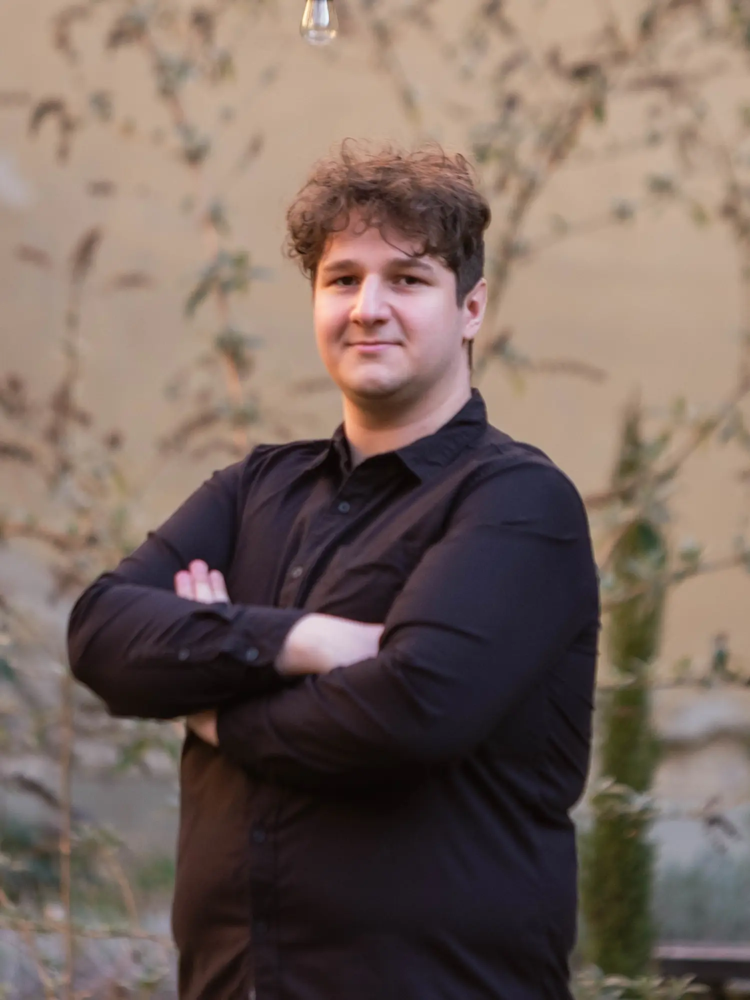
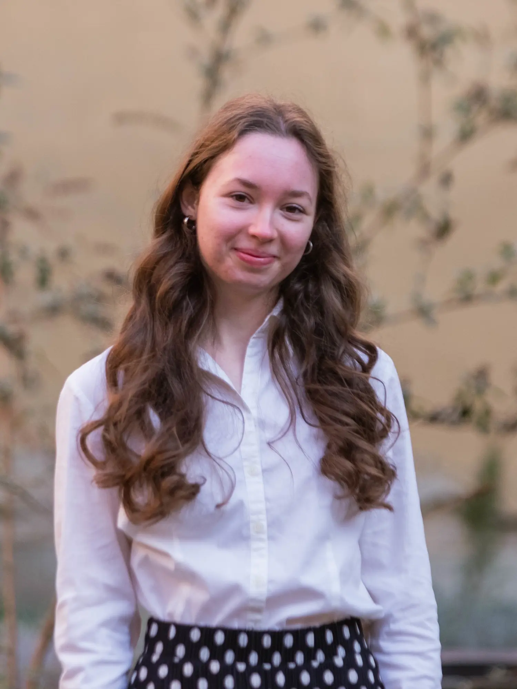

	
<h2 style="display: inline-block;">Menü</h2>

- [Kezdőlap](/mobile_version.html)
- [Rólunk](/rolunk.html)
- [Programok](/programok.html)
- [Szakmai nap](/SzakmaiNap.html)
- [Felvételi](/Felveteli.html)
- [Galéria](/Galeria.html)
- [Dokumentumok](/dokumentumok.html)
- [DiákBizottság](/DB.html)
- [Felújítások](/felujitasok.html)
- [FerencEST](/ferencest.html)

# A Diákbizottság és Én

Mint minden jó szakkollégiumban a Szeráfban is működik a munkacsoport (röviden: MCs) rendszer. Minden szakkollégistának
félévente 10 órát kell teljesítenie valamelyik MCs-ban. A DiákBizottság (ezután csak DB) tagjai ezen csoportok vezetői,
valamint az elnök és segédje, az alelnök. Mindüket egyszerre szoktuk választani a második félévben, s mandátumuk 1 évre
szól.

## A munkacsoportok:

- Belügyi
- Kommunikációs
- Közösségi
- Külügyi
- Lelki
- Toborzó

## A jelenlegi (2025/26 I.) DB tagok:

- ### DB Elnök: Pazicska Dóra\

 
*Bemutatkozás*

A Pécsi Tudományegyetem Bölcsészet- és Társadalomtudományi Karának másodéves tanár szakos hallgatója vagyok, magyar
nyelv és -irodalom; földrajz szakpárokkal. Elsődleges szempont számomra, hogy a Diák Bizottságon belül a kommunikáció és
a munkavégzés minél hatékonyabb legyen, ami megkívánja a felektől az őszinte és nyílt beszédformákat, valamint a
támogató, kooperatív légkört.
Az idei szemeszterben a Diákbizottság Elnökeként az én elsődleges feladatom, hogy segítsem és támogassam a munkacsoport
vezetők munkáját. Emellett adminisztrációs feladatokat végzek, továbbá a munkacsoport vezetőknek segítek a projektek
megtervezésében és végrehajtásában.

- ### DB Alelnök: Ruszcsák Bori\

 
*Bemutatkozás*

 A Pécsi Tudományegyetem Bölcsészet- és Társadalomtudományi Karának Közösségszervező szakos hallgatója vagyok. Nyitott, kreatív és lelkes emberként igyekszem összefogni a Diákbizottság tagjait. Kapcsolataimban vezérelv a nyílt kommunikáció és az emberközpontúság, legyen szó a vezetőségről vagy a szakkollégistákról. Elnökként két hetente hívom össze a Diákbizottság tagjait megbeszélés céljából, mely egyben nyitott térként is szolgál, bármely szakkollégista részt vehet rajta, mint hallgatóság. Feladatkörömbe sorolandó még a Kollégium Tanácsban és a Felvételi Bizottságban való aktív részvétel. Összességében a rendelkezésemre álló pszichologiai és az eddig megszerzett tapasztalati tőkére alapozva, a munkacsoport vezetők személyében egy segítő csapattal együttműködve munkálkodom a kollégiumi mindennapok jobbá tételén.

- ### Belügyi Munkacsoport: Kertai József Károly\

 
*Bemutatkozás*

     A Pécsi Tudományegyetem Általános Orvostudományi Karának hallgatójaként a tanulmányaim megkezdése óta vagyok kollégista. A Belügyi Munkacsoporttal azon dolgozunk, hogy a kollégium épületét napról-napra egyre komfortosabb és otthonosabb hellyé tegyük. Ennek elősegítésére többek közt szervezünk közös kertészkedéseket, részt veszünk a közösségi tereink tisztán tartásában, valamint együtt felelünk az eszközpark fejlesztéséért. A munkacsoport vezetőjeként szívügyem, hogy mindezt a fenntarthatóság jegyében vigyük véghez.

- ### Kommunikációs Munkacsoport: Magyar Tünde\

 
*Bemutatkozás*

     A Pécsi Tudományegyetem Egészségtudományi Karának Ápolás- és betegellátás, szülésznő szakos hallgatója vagyok. Munkacsoportommal képviseljük kollégiumunkat a közösségi médiában, illetve nálunk történik a honlap szerkesztése is. Fontos számomra, hogy megosszuk értékeinket, nyomon követhetőséget biztosítsunk programok szempontjából, emellett a jövőbeni jelentkezőknek is tájékozódási lehetőséget nyújtsunk.

- ### Közösségi Munkacsoport: Geréb Sarolta\

 
*Bemutatkozás*

     A Pécsi Tudományegyetem Egészségtudományi Karának Táplálkozástudományi mesterszakos hallgatójaként kollégiumunkban a Közösségi Munkacsoportért felelek. Fontosnak tartom, hogy az itt lakók ne csak szállásként tekintsenek a kollégiumra, hanem otthon is érezzék itt magukat, ezért célom, hogy a munkacsoportommal együtt olyan programokat szervezzünk, amelyek mindenki számára értéket és élményt jelentenek, hozzájárulva egy élőbb és összetartóbb közösség formálásához.

- ### Külügyi Munkacsoport: Izsa Hunor\

 
*Bemutatkozás*

     A Pécsi Tudományegyetem Természettudományi Karának negyedéves földrajz-történelem tanár szakos hallgatója vagyok. A külügyi munkacsoport elsődleges feladata a kollégium és a külsős személyek, illetve intézmények közötti kapcsolattartás. Kis csapatunk foglalkozik továbbá a kollégium alumni-csoportjának kezelésével és a remek közös programok szervezésével a tagok számára. A tavaszi félév során mi bonyolítjuk le a kollégiumi véradást is, illetve az őszi időszakban jótékonykodással igyekszünk erősíteni a ferences lelkiség gyakorlását a városban. A külügyi munkacsoport tartja a kapcsolatot a más pécsi keresztény közösségekkel is, így csatolva be a kollégiumot a szélesebb, Krisztusi gyülekezetbe.

- ### Lelki Munkacsoport: Ocskay Flóra Anna\

 
*Bemutatkozás*

     A Pécsi Tudományegyetem Bölcsészet- és Társadalomtudományi Karának történelem szakos hallgatója vagyok. A lelki munkacsoport vezetőjeként a kollégisták Istennel való kapcsolatteremtését, valamint kapcsolattartását próbálom segíteni a munkacsoportommal. Ehhez szentségimádásokat, esti imákat és számos lelki programot szervezünk. Munkánkat segíti egy lelkes zenész csapat is.

- ### Toborzó Munkacsoport: Böhm Kristóf\

 
*Bemutatkozás*

     A Pécsi Tudományegyetem Egészségtudományi Karának Mentőtiszt szakos hallgatója vagyok. A Toborzó Munkacsoport vezetőjeként egy barátságos, s egyben professzionális környezetben dolgozunk azért, hogy a jövő kollégistái számára egy vonzó lakhatási lehetőség legyen a Szeráf. Továbbá az újonnan érkezett kollégisták beilleszkedését is segítjük csapatommal, ezért szeretnénk a következő félévben is megszervezni a „Mentor programot”. Ezek mellett a kollégiumi felvételiért és „merchandise” termékekért is mi felelünk. 

