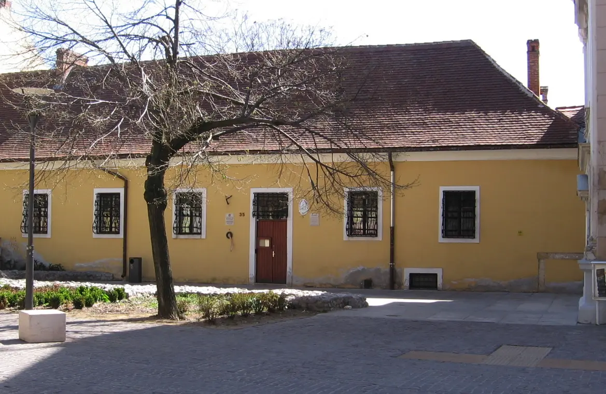

	
<h2>Menü</h2>

- [Rólunk](/rolunk.html)
- [Programok](/programok.html)
- [Szakmai nap](/SzakmaiNap.html)
- [Felvételi](/Felveteli.html)
- [Galéria](/Galeria.html)
- [Dokumentumok](/dokumentumok.html)
- [DiákBizottság](/DB.html)
- [Felújítások](/felujitasok.html)

Kedves Gólyák!
-------------------
Örömmel hirdetjük, hogy a ti érkezéseteket előkészítők szorgos csapata egy pdf-ben összefoglalta nektek a legfontosabb
tudni valókat! Még térkép is vagyon benne a zegzugos épület útvesztőjéről™. Használjátok
egészséggel! [Katt ide!](/src/Szeráf_KÉSZ_velemjáró.pdf)

+---------------------------------------------------------------------------------+
| ### A jelentkezési határidők a 2025/2026-os tanévre:                              |
+===========+=======================================+=============================+
| | jelentkezési határidő:                | augusztus 11 (péntek)|
| +---------------------------------------+-----------------------------+
| Újak |szóbeli elbeszélgetése:                |augusztus 18-19. (hétfő-kedd)|
| +---------------------------------------+-----------------------------+
| |kiértesítése felvételről/elutasításról:| augusztus 25 (hétfő)|
+===========+=======================================+=============================+
| | jelentkezési határidő:                | június 13. (péntek)|
| Régiek +---------------------------------------+-----------------------------+
| |kiértesítése felvételről/elutasításról:| július 18. (péntek)|
+-----------+---------------------------------------+-----------------------------+

### ***„Értelmet adok neked, megtanítalak az útra, amelyen járnod kell.“ ***   (Zsoltárok 32, 8)

S hogy te, mint leendő elsőéves, mire számíthatsz?

Először is, nem kell félned a leendő szobatársadtól, hiszen a keresztény értékrend közös alapként mindannyiunkban ott
él. Nem leszel elveszett, mivel ebben a családias légkörben segítőkész felsőbb évesekre és egyben társakra találsz, akik
azon munkálkodnak, hogy te is mihamarabb megtaláld itt a helyedet!

## Lakhatásitámogatások:

Szerencsére az alábbi összegek a 2023/2024-es tanévtől jelentősen csökkentek a MOL Új Európa Alap támogatásának
köszönhetően, amellyel minden kollégistát tudtunk támogatni, egy főre jutó keresettől függően havi 10.000 vagy 20.000
Ft-tal, továbbá a 2025/2026-ös tanév óta a nálunk lakók a PTE EHÖK által meghírdetett támogatásra is jelentkezhetnek.

+--------------------------------------------------------------------+
| ### A kollégiumi díj a 2025/2026-ös tanévre:                       |
+===========+===============================+========================+
|   ÁLLAMI  | Szakkollégista:               |          40.000 Ft / hó|
|ÖSZTÖNDÍJAS+-------------------------------+------------------------+
| tanulóknak|Albérlő:                       |          50.000 Ft / hó|
+===========+======+========================+========================+
| KÖLTSÉGTÉRÍTÉSES |Szakkollégista:         |          52.000 Ft / hó|
|                  +---------------------------+---------------------+
|    tanulóknak    |Albérlő:                |          62.000 Ft / hó|
+------------------+------------------------+------------------------+

***Költségtérítéses (nem államilag támogatott) képzés esetén a kollégiumi díj az aktuális állami normatíva mértékével
emelkedik!***

## Mit is rejtenek a falak?

A kollégium zegzugos, labirintusszerű folyosói, kápolnája és két belső kertje lehetővé teszik, hogy akkor és ott
tanuljunk, kapcsolódjunk ki vagy éppenséggel leljünk csendre, ahol kedvünk tartja.

### Hol is vannak a falak?

[Még a Google Térkép felhőiről is láthatóak vagyunk!](https://maps.app.goo.gl/fpFwJwAoaB52ycz87)

Maga az épület a belváros szívében, frekventált helyen található, közel a templomokhoz, a vasútállomáshoz és a
buszpályaudvarhoz. Ráadásul az egyetemi karok épületei is elérhetőek egy kényelmes sétával vagy akár biciklivel. Ez a
központi elhelyezkedés a közösség összetételén is visszaköszön, lévén, hogy minden karról és megannyi szakról érkező
hallgató gazdagítja és szélesíti a látókörünk horizontját jelenlétével.

## Amiket be kell adni az ÚJ jelentkezőknek:

- [jelentkezési lap](/src/documents/2025/Jelentkezesi%20lap_%C3%9Ajaknak_2025.docx)
- [jelentkezéshez szükséges dokumentumok listája](/src/documents/2025/Dokumentumok%20list%C3%A1ja_%C3%9Aj%20jelentkez%C5%91k_2025.docx)

## Amiket be kell adni azoknak, akik az elmúlt tanévben már a kollégiumban laktak:

- [jelentkezési lap](/src/documents/2025/Jelentkez%C3%A9si%20lap_R%C3%A9gieknek_2025.docx)
- [jelentkezéshez szükséges dokumentumok listája](/src/documents/2025/Dokumentumok%20list%C3%A1ja_R%C3%A9giek_2025.docx)

<iframe allow="clipboard-write" allowfullscreen="allowfullscreen" class="fp-iframe" scrolling="no" style="aspect-ratio: 210/297; width: 100%;" src="https://heyzine.com/flip-book/ffb3c64821.html"><iframe>