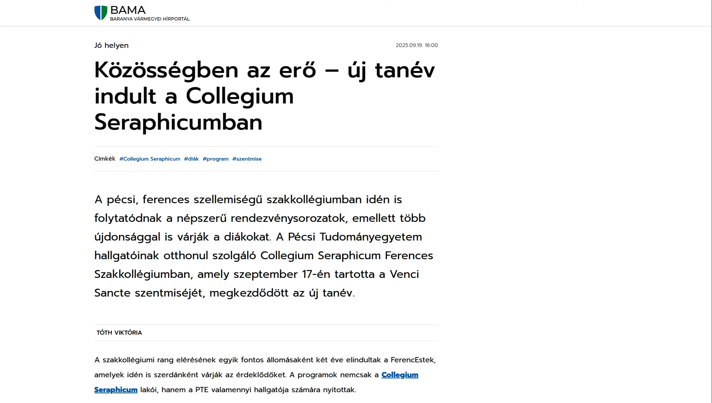
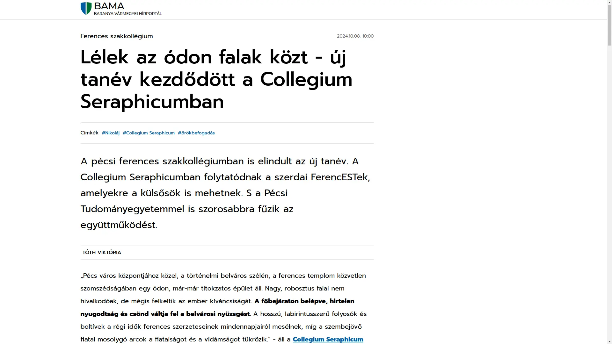
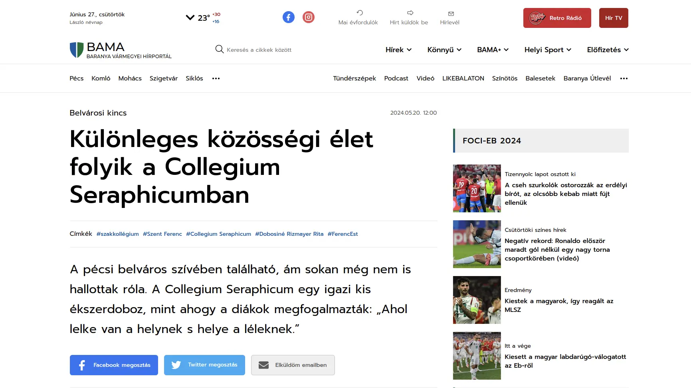

	
<h2 id="Menu" style="display: inline-block;">Menü</h2>

- [Kezdőlap](/mobile_version.html)
- [Rólunk](/rolunk.html)
- [Programok](/programok.html)
- [Média](/Media.html)
- [Szakmai nap](/SzakmaiNap.html)
- [Felvételi](/Felveteli.html)
- [Galéria](/Galeria.html)
- [Dokumentumok](/Dokumentumok.html)
- [DiákBizottság](/DB.html)
- [Felújítások](/felujitasok.html)
- [Kapcsolat](/kapcsolat.html)
- [FerencEST](/ferencest.html)

# Média megjelenéseink:

<section>
	<a href="https://zarandok.ma/uj-nemzedek-regi-ertekek-a-ferences-lelkiseg-ereje-pecsen-noiterero/" target="_blank">
		<h2>NőiTérErő</h2>
	</a>
<iframe src="https://zarandok.ma/uj-nemzedek-regi-ertekek-a-ferences-lelkiseg-ereje-pecsen-noiterero/"></iframe>
  </section>

<section>
	<a href="https://www.bama.hu/helyi-kozelet/2025/09/collegium-seraphicum-szakkollegium-pecs" target="_blank">
		<h2>bama.hu</h2>
	</a>
	
</section>

<section>
	<a href="https://www.youtube.com/watch?v=RPv9pVK62xk" target="_blank">
		<h2> Böjte Csaba a Seraphicumban!</h2>
	</a>
 <iframe allow="accelerometer; autoplay; clipboard-write; encrypted-media; gyroscope; picture-in-picture; web-share" allowfullscreen frameborder="0" height="315" referrerpolicy="strict-origin-when-cross-origin" src="https://www.youtube-nocookie.com/embed/RPv9pVK62xk?si=1btYbDekM9BgKLI1" title="Böjte Csaba a Seraphicumban!" width="100%">
	</iframe>
</section>

<section>
	<a href="https://youtu.be/hd4ANTm9cwg?t=458" target="_blank">
		<h2>FerencEST Dr. Fedeles Tamással</h2>
	</a>
	<iframe allow="accelerometer; autoplay; clipboard-write; encrypted-media; gyroscope; picture-in-picture; web-share" allowfullscreen frameborder="0" height="315" referrerpolicy="strict-origin-when-cross-origin" src="https://www.youtube-nocookie.com/embed/hd4ANTm9cwg?si=PCeE0VvLZTt3-WAA&amp;start=458" title="FerencEST Dr. Fedeles Tamással" width="100%">
	</iframe>
</section>

<section>
	<a href="https://www.youtube.com/watch?v=VQI2B4mjIuU" target="_blank">
		<h2> Kiemelkedően eredményes emberek</h2>
	</a>
	<iframe allow="accelerometer; autoplay; clipboard-write; encrypted-media; gyroscope; picture-in-picture; web-share" allowfullscreen frameborder="0" height="315" referrerpolicy="strict-origin-when-cross-origin" src="https://www.youtube-nocookie.com/embed/VQI2B4mjIuU?si=py9TneVeBej0HNK4" title="Kiemelkedően eredményes emberek" width="100%">
	</iframe>
</section>

<section>
	<a href="https://www.youtube.com/watch?v=6ObFL0rzHw0" target="_blank">
		<h2>Roratei szolgálatunk</h2>
	</a>
	<iframe allow="accelerometer; autoplay; clipboard-write; encrypted-media; gyroscope; picture-in-picture; web-share" allowfullscreen frameborder="0" height="315" referrerpolicy="strict-origin-when-cross-origin" src="https://www.youtube-nocookie.com/embed/y7-mWlPk_ss?si=lfSMd6UaG6AQ5dZk" title="Roratei szolgálatunk" width="100%">
	</iframe>
</section>

<section>
	<a href="https://www.bama.hu/helyi-kozelet/2024/10/collegium-seraphicum-pte-szakkollegium?fbclid=IwY2xjawFzMnpleHRuA2FlbQIxMAABHUXaEQGExFUw2FMna4EqCTfdGthO1R8tZ_hHK05PsbD048sBlNc7lDnxXw_aem_QV8QtlEdVRITIUmCq168eg"
target="_blank"><h2>
 bama.hu</h2></a>
	
  </section>

<section>
	<a href="https://www.youtube.com/watch?v=6ObFL0rzHw0" target="_blank">
		<h2>Pannon Televízió</h2>
	</a>
	<iframe allow="accelerometer; autoplay; clipboard-write; encrypted-media; gyroscope; picture-in-picture; web-share" allowfullscreen
frameborder="0" height="315" referrerpolicy="strict-origin-when-cross-origin" src="https://www.youtube-nocookie.com/embed/6ObFL0rzHw0?si=3H9kehS7ILd-efok" title="YouTube video player" width="100%">
	</iframe>
</section>

<section>
	<a href="https://www.katolikusradio.hu/archivum.php?firstaudioid=17&mev=2024&mho=07&mnap=19&mora=17&mperc=05"
target="_blank">
		<h2>Magyar Katolikus Rádió</h2>
	</a>
	<iframe src="https://www.katolikusradio.hu/archivum.php?firstaudioid=17&mev=2024&mho=07&mnap=19&mora=17&mperc=05">
	</iframe>
</section>

<section>
	<a href="https://www.bama.hu/helyi-kozelet/2024/05/collegium-seraphicum-otthon" target="_blank">
		<h2>bama.hu</h2>
	</a>
	
</section>

<section>
	<a href="https://www.katolikusradio.hu/archivum.php?firstaudioid=20&mev=2024&mho=04&mnap=06&mora=20&mperc=04"
target="_blank">
		<h2>Magyar Katolikus Rádió</h2>
	</a>
	<iframe src="https://www.katolikusradio.hu/archivum.php?firstaudioid=20&mev=2024&mho=04&mnap=06&mora=20&mperc=24">
	</iframe>
</section>

<section>
	<a href="https://www.youtube-nocookie.com/embed/2bYFC_cr9as?si=EZpoOBrCmlg8NGxW&amp;start=2231"
target="_blank">
		<h2>Pécsi Egyházmegye YouTube</h2>
	</a>
	<iframe allow="accelerometer; autoplay; clipboard-write; encrypted-media; gyroscope; picture-in-picture; web-share" allowfullscreen class="youtube" frameborder="0" referrerpolicy="strict-origin-when-cross-origin" src="https://www.youtube-nocookie.com/embed/2bYFC_cr9as?si=EZpoOBrCmlg8NGxW&amp;start=2231" title="YouTube video player">
	</iframe>
</section>

<section>
	<a href="https://www.magyarkurir.hu" target="_blank">
		<h2>Magyar Kurír!</h2>
	</a>
<iframe src="https://www.magyarkurir.hu/hirek/keddenkent-ferencestekre-varja-pecsi-collegium-seraphicum-az-egyetemistakat"></iframe>
  </section>

<section>
	<a href="https://pecsiegyhazmegye.hu/hirarchivum/5949-ferencestek-a-megujulas-utjat-jaro-collegium-seraphicum-varja-az-egyetemistakat"
target="_blank">
		<h2>Pécsi Egyházmegye</h2>
	</a>
	<iframe src="https://pecsiegyhazmegye.hu/hirarchivum/5949-ferencestek-a-megujulas-utjat-jaro-collegium-seraphicum-varja-az-egyetemistakat">
	</iframe>
</section>

<section>
	<a href="https://www.youtube.com/watch?v=7bYNFprgprM" target="_blank">
		<h2>Univ TV</h2>
	</a>
	<iframe allow="accelerometer; autoplay; clipboard-write; encrypted-media; gyroscope; picture-in-picture; web-share" allowfullscreen
frameborder="0" eight="315" referrerpolicy="strict-origin-when-cross-origin" src="https://www.youtube-nocookie.com/embed/7bYNFprgprM?si=EikFhsk5DxRNXJ4L" title="YouTube video player" width="100%">
	</iframe>
</section>

<section>
	<a href="https://www.facebook.com/watch/?v=1152688272417577" target="_blank">
		<h2>Pannon Televízíó</h2>
	</a>

	<iframe allow="autoplay; clipboard-write; encrypted-media; picture-in-picture; web-share" allowFullScreen="true" allowfullscreen="true" frameborder="0" height="314" scrolling="no" src="https://www.facebook.com/plugins/video.php?height=314&href=https%3A%2F%2Fwww.facebook.com%2Fpannon.televizio%2Fvideos%2F1152688272417577%2F&show_text=false&width=560&t=0" style="border:none;overflow:hidden" width="100%"></iframe>
	</iframe>

</section>

<section>
	<a href="https://www.youtube.com/watch?v=7ODSjWrG8xo" target="_blank">
		<h2>Véradás a Szeráf Koliban</h2>
	</a>
	<iframe allow="accelerometer; autoplay; clipboard-write; encrypted-media; gyroscope; picture-in-picture; web-share" allowfullscreen
frameborder="0" height="315" referrerpolicy="strict-origin-when-cross-origin" src="https://www.youtube-nocookie.com/embed/7ODSjWrG8xo?si=8LzmK7qi9CpiqssW" title="YouTube video player" width="100%"></iframe>
	</iframe>
</section>

