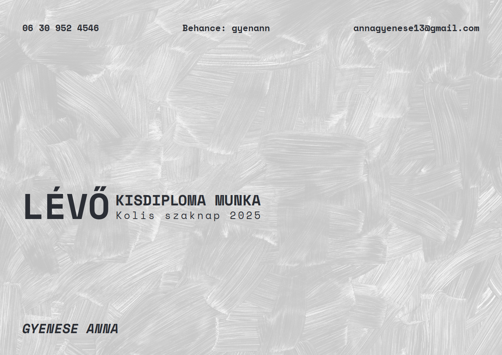
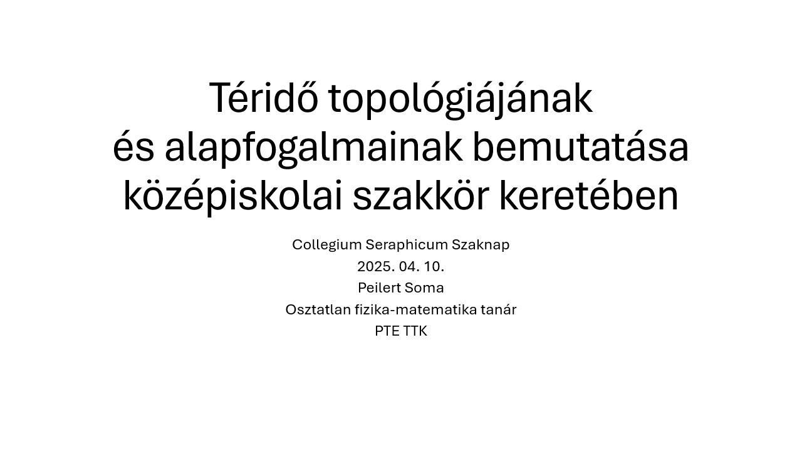
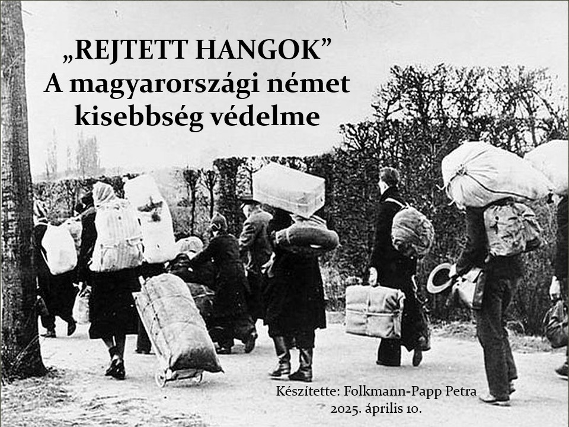

	
<h2>Menü</h2>

- [Kezdőlap](/mobile_version.html)
- [Rólunk](/rolunk.html)
- [Programok](/programok.html)
- [Szakmai nap](/SzakmaiNap.html)
- [Felvételi](/Felveteli.html)
- [Galéria](/Galeria.html)
- [Dokumentumok](/dokumentumok.html)
- [DiákBizottság](/DB.html)
- [Felújítások](/felujitasok.html)

# Szakmai nap

### 2025.04.06.

A Szakmai nap a szakkolllégiumnak egy olyan esemény a szakkollégium életében, mikor is minden itt lakó meg
csillogtattathatja az eddig szerzett tudását. Valaki a TDK vagy szakdolgozat témáját hozza rövid bemutatóra, valaki
edukál, és akad olyan is, ki csak fun-fact-ekkel provokálja a hallgatóság szürkeállományát.
Az alábbiakban a legutóbbi év előadóit és témáit mutatnánk be röviden a kedves olvasónak!

## LÉVŐ - Kisdiplom Munka

	
Gyenese Anna - Grafikusművész

	
 Kisdiploma munkám egy képregény, ami a mesés keleten játszódik: ebben a 32 oldalas “pilot” kiadványban, melyet a jövőben további kötetekkel szeretnék folytatni, bepillantást nyerhetünk egy elképzelt birodalomba, amit csak a halott sivatag vesz körül: ez az egyetlen, ami él, ami van: LÉVŐ.

## A Point of Care Ultrahang vizsgálata

	
Böhm Kristóf - Mentőtiszt

	
 Előadásomban a Point of Care ultranhangot mutattam be, mint jelentős diagnosztikus előrelépés az egészségügyben. Továbbá a hallgatóság betekintést nyerhetett kutatási témámba is, mely ezen eszköz használatának oktatási lehetőségeivel foglalkozik. Szó esett az eszköz előnyeiről, diagnosztikus pontosságáról, elméleti, illetve gyakorlati oktatásáról. Bízom benne, hogy a jövőben újabb kutatási eredményekkel szolgálhatok a témában.

## Finnugor nyelv-e a Magyar?

	
Pazicska Dóra - Földrajz; magyar nyelv és -irodalom szakos tanár

	
 Előadásom célja az volt, hogy különböző nyelvészeti módszerekkel (hangtani egyezések, hangváltozások megfigyelése) bebizonyítsam azt a nyelvészeti tényt, miszerint a magyar az uráli nyelvcsaládba, ezen belül is a finnugor ághoz tartozik. Az előadás első részében szó esett az ősi szókészlet fogalmáról és tartalmáról. A bizonyítás során a finn és magyar mássalhangzó rendszereket hasonlítottuk össze. A végső cél az volt, hogy bebizonyítsuk a társadalmunkban elterjedt tévhitek hamisságát anyanyelvünk eredetéről.

## Drogpolitika Magyarországon

	
Böhm Patrik - Jogász

	
 Előadásomban a hazai kábítószerrel kapcsolatos szabályozást vizsgáltam meg. Rövid történeti kitekintést követően a jelenkor drogpolitikáját ismertettem a jelenlévők számára. Előadásom végén kitértem a lehetséges jövőre, már ami a jogszabályi környezetet illeti.

## Kiberbiztonság

	
Kovács Mihály - Mérnökinformatikus

	
 Jelen korunk egyik jellegzetes problémája a virtuális és a tapintható valóságok szétválaszthatatlansága. Mindennapivá vált számunkra, hogy az emberiség kollektív tudása már nem a kisujjunkban lakozék, hanem a zsebünkben. Na de mi van azokkal a kevésbé publikusnak szánt, de mégis ugyanazon eszközön tárolt információkkal? Előadásomban megpróbáltam körbejárni ezen információk típusait, miben létét és hogy milyen feltételeket kell szabnunk ahhoz, hogy biztonságban tudhassuk őket…

## Téridő topológiájának és alapfogalmainak bemutatása középiskolai szakkör keretében

	
Peilert Soma - Fizika-matematika tanár

	
 Az általános relativitáselmélet és az ahhoz kapcsolódó témák, mint például a fekete lyukak, ősrobbanás nem jelennek meg a középiskolai fizika órákon, viszont a diákokat leginkább pont ezek izgatják. Az OTDK keretében középiskolás diákoknak állítottam össze egy anyagot és tartottam egy öt alkalmas szakkört. Ezeken az alkalmakon a bonyolult analízist topológiai szemlélettel pótoltuk, ami a vizuális megközelítést segítette. Az előadás a szakkörön elhangzottakat és annak pedagógiai részleteit foglalja össze.

## „REJTETT HANGOK” - A magyarországi német kisebbség védelme

	
Folkmann-Papp Petra - Jogász

	
 Folkmann-Papp Petra, a Pécsi Tudományegyetem negyedéves jogász szakos hallgatója vagyok. Előadásomban a magyarországi német közösség kulturális öröksége, nyelve, hagyományai megőrzése mellett a jogi helyzetüket is bemutattam: kitértem a vonatkozó hazai és uniós jogszabályokra, gyakorlati problémákra és esettanulmányokra is. Német nemzetiségűként ez a téma számomra nemcsak szakmai, hanem személyes jelentőséggel is bír – hiszem, hogy a kisebbségek jogainak védelme hozzájárul a társadalmi sokszínűség és tolerancia erősítéséhez.

## Miért több egy historia domus, mint egy egyháztörténeti forrás?

	
Ocskay Flóra Anna - Történelem

	
 Az I. Szakkollégiumi szaknapon a "Miért több egy historia domus, mint egy egyháztörténeti forrás?" című előadásomat adtam elő. Ezzel a történelmet szerettem volna népszerűsíteni, valamint ennek a különleges egyházi forrásnak a sokrétűségét bemutatni. Szó volt többek között magáról a historia domusról, a keletkezési helyéről és idejéről (Kesztölc;1919 – 1945), valamint a sokszínű felhasználási lehetőségekről. Kiváló alkalomnak találtam ezt a délutánt arra, hogy mások érdeklődési területeibe is bekapcsolódhassam és gyakorolhassak én is.

