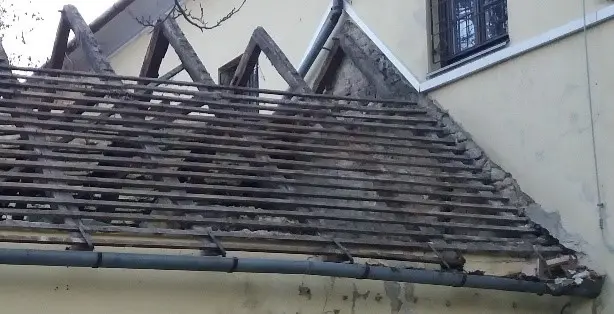
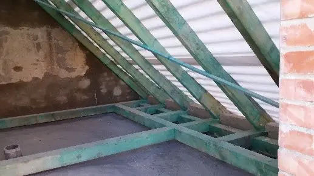
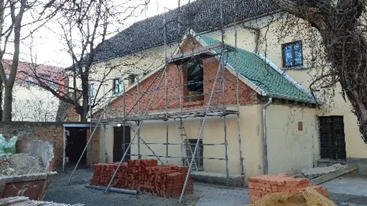
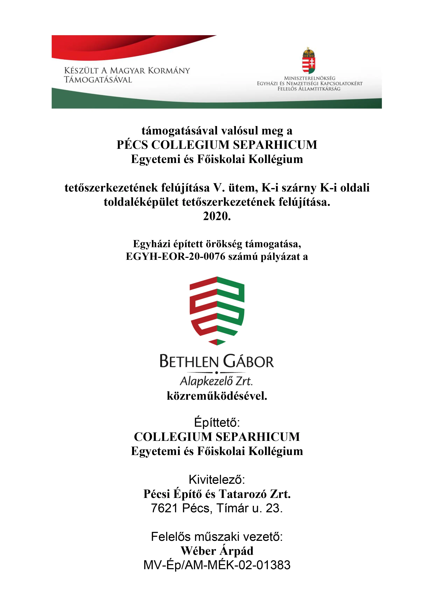
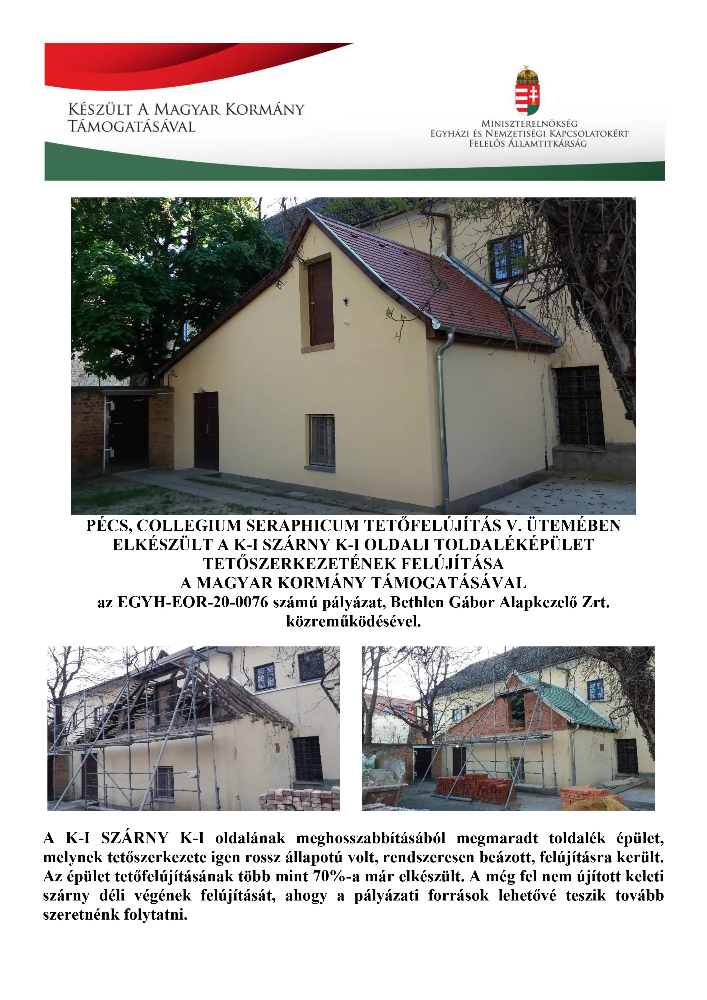

	
<h2 style="display: inline-block;">Menü</h2>

- [Kezdőlap](/mobile_version.html)
- [Rólunk](/rolunk.html)
- [Programok](/programok.html)
- [Szakmai nap](/SzakmaiNap.html)
- [Felvételi](/Felveteli.html)
- [Galéria](/Galeria.html)
- [Dokumentumok](/Dokumentumok.html)
- [DiákBizottság](/DB.html)
- [Felújítások](/felujitasok.html)
- [Kapcsolat](/kapcsolat.html)
- [FerencEST](/ferencest.html)

A kollégium épületének felújítása egy folyamatos projekt, melyet azon tény is nehezít, miszerint ez egy műemlék... Ez
nem csak azt jelenti, hogy vastagok a falai, s egy némely köveibe egészen régi keresztény szimbólumok lettek bele vésve.
Ezzel a ténnyel bizony együtt jár a korszerű szó lecserélése korhűre! No, persze azért nem kell megijedni, van hűtőgép,
mosógép, angol WC az épületen belül, de ha a tetőszerkezet felújításáról val szó, akkor azt csakis az építési korának
megfelelő ács technikákkal lehet elvégezni!
Éppen ezért az elmúlt három évben főleg a belső megújulásra koncentráltunk, amit könnyebb kivitelezni: a
szobák, közösségi terek újrafestése, új közös háztartási gépek beszerzése, új közhasznú terek kialakítása, a régiek
rendbe
tétele, stb.
Szeretnénk újra nekiállni és nagyobb léptékű munkákat végre hajtani a kollégium épületén, sajnos azonban ez egyedül
kollégiumi díjakból nem megoldható. A lentiekben látható, hogy egy "kis" segítséggel már milyen nagy eredményeket
lehet elérni!

## Fejlesztések, felújítások

#### 2021

### Elkészült a pécsi ferences kolostorban működő Collegium Seraphicum tetőfelújítás V. üteme

Az egykori ferences kolostor épülete 1720-1760 között épült. A ma működő kollégium épületét, jószerével öt ütemben,
negyven év alatt építették fel a ferences szerzetesek. A jelen ütemben, a pécsi Collegium Seraphicum teljes
tetőfelújításának V. ütemében az épület keleti szárnyának keleti toldaléképületének tetőszerkezete újult meg.

A keleti szárny keleti irányú meghosszabbítására földszintjén az áthelyezett posztóműhellyel, emeletén a könyvtárral
1769-ben került sor. Az épületszárny faszerkezetét valószínűleg egy korábban elbontott épület faanyagából készítették,
mivel több helyen is látszanak régebbi kivágások, csapolások nyomai.

A ferences szerzetesek pécsi működését megszüntető 1950-es állami intézkedést követő – hajdani ferences kolostor vegyes
használata után - az 1970-es évektől turista szállóként történő üzemeltetés idején, a tetőt helyenként felújították, ami
a héjalás cseréjét, javítását jelentette. Az 1990-es évek elején visszakerült a Ferences Rendhez az épület, és újra
nyitott a Collegium Seraphicum. Ezalatt az időszak alatt, csak a tető kisebb javításaira került sor, de az épület
állapota miatt ma már halaszthatatlanná vált a hibák gyökeres orvoslása és a tető teljes felújítása. A K-i szárny K-i
oldalának meghosszabbításából megmaradt toldalék épület, melynek tetőszerkezete igen rossz állapotú volt, rendszeresen
beázott, felújításra került.

Az épület tetőfelújításának több mint 70%-a már elkészült. A még fel nem újított majd száz méter hosszú keleti szárny
déli végének felújítását a VI. ütemben tovább szeretnénk folytatni, ahogy a pályázati források lehetővé teszik. A
felújítás V. üteme 7.000.013 forintba került, amelynek forrása a Magyar Kormány támogatásával, az Egyházi és Nemzetiségi
Kapcsolatokért Felelős Államtitkárság EGYH-EOR-20-0076 számú nyertes pályázata keretében elnyert 7 millió forintból, a
Bethlen Gábor Alapkezelő Zrt. közreműködésével és a fenntartó támogatásával valósult meg. Kivitelező a PÉCSI ÉPÍTŐ ÉS
TATAROZÓ ZRT. volt. A korábbi felújítási ütemekben a kolostor belső udvarát – a kvadrumot – körbezáró épületszárnyak
tetőfelújítása és az épület teljes villámvédelme elkészült. E munka eredményeként Pécs város látképében is meghatározó
értékű épületegyüttes felújítása tovább őrzi a város történelmi múltjának kiemelt értékét.

#### 2019. június

### Elkészült a pécsi ferences kolostorban működő Collegium Seraphicum tetőfelújítás IV. üteme

Az egykori ferences kolostor épülete 1720-1760 között épült. A ma működő kollégium épületét, jószerével öt ütemben,
negyven év alatt építették föl a ferences szerzetesek. A jelen ütemben, a pécsi Collegium Seraphicum teljes
tetőfelújításának IV. ütemében az épület villámvédelme valósult meg.

A villamoshálózat 1911 utáni kiépítése, még viszonylag kevés villámcsapási eshetőséget indukált, még a második
világháborút követő években is. A ferences szerzetesek pécsi működését megszüntető 1950-es állami intézkedést követő –
hajdani ferences kolostor vegyes használata után - az 1970-es évektől turista szállóként történő üzemeltetés idején,
először, csupán a templomtorony villámvédelmének kiépítésére került sor. Ez is csak egyetlen levezetővel.

A villámhárító rendszer kiépítéséig, a tetőfelújítás 70%-a már elkészült. A kollégiumban lakó diákok használatában lévő
gyengeáramú rendszere, így a szerverhez kötött számítógépes hálózat, valamint a tetőtéri kazánt-működtető elektronikai
hálózatának védelme, valamint a felújított – teljes egészében műemléki védelem alatt álló - vörösfenyő tetőszerkezet
villámcsapás okoztat tetőtűz megelőzése, az utóbbi évek orkánszerű viharai miatt fokozottan előálló veszélyhelyzete, ma
ezt a legsürgetőbb feladatként határozta meg.

A felújítás IV. üteme 11,7 millió forintba került, amelynek forrása a Magyar Kormány támogatásával, az Egyházi és
Nemzetiségi Kapcsolatokért Felelős Államtitkárság EGYH-EOR-18-0694 számú nyertes pályázata keretében elnyert 10 millió
forintból, a Bethlen Gábor Alapkezelő Zrt. közreműködésével és a fenntartó 1,7 millió forintos támogatásából valósult
meg. A kollégium – az egykori ferences kolostor – és a templom egyetlen építészeti együttest alkot, és egyetlen
villámvédelmi rendszer. A pécsi püspökség tulajdonában álló templom villámvédelmi rendszerét a püspökség finanszírozta
és a kollégium valamint a templom villámvédelmi rendszere együttesen jött létre. A templomban a villamos energia
igénybevételével működő orgona vezeték-hálózatának védelmét is meg kellett oldani a püspökséget terhelve.

Az épületegyütteshez 29 ponton (helyen) készült „A” típusú földelő. A levezetők szabvány szerinti elhelyezését kellett
figyelembe venni. Ahol lehetett, ott az épület sarkokban, az esővíz levezető csatorna takarásába telepítve, kevésbé
zavarja a műemlék-épület homlokzatát, látványát.

A 28/2011.(IX.6.) BM. rendelettel kiadott Országos Tűzvédelmi Szabályzat (OTSZ) szerint, 50 főt befogadó képesség
felett, LPS III. fokozatú villámvédelmi rendszerrel kell létesíteni, ami a telepített rendszer teljesít.

A majd száz méter hosszú szárny déli végén még ezt követően kell majd, a tetőszerkezet felújítását, új cserépfedését
elkészíteni az V. ütemben. A korábbi felújítási ütemekben a kolostor belső udvarát – a kvadrumot – körbezáró
épületszárnyak tetőfelújítása elkészült. E munka eredményeként Pécs város látképében is meghatározó értékű
épületegyüttes felújítása tovább őrzi a város történelmi múltjának kiemelt értékét.

#### 2018. július 27.

### Elkészült a pécsi ferences kolostorban működő Collegium Seraphicum tetőfelújítás III. üteme

Az egykori ferences kolostor – ma a Collegium Seraphicum – épülete 1720-1760 között eltelt 40 év alatt valósult meg.
1686. október elsején Pécs városát – 143 évi török rabságot követően – a keresztény seregek a törököktől
visszafoglalták. 1700 nyarán a ferences szerzetesek visszatelepedtek török imahelyet keresztény templommá
visszaalakítva. Majd neki láttak – kolduló rend módjára, az építés feltételeit összekoldulva – kolostoruk megépítéséhez.
A történelem szinte ismétli önmagát, ahogy a barokk kori tetőszerkezet megújítására vállalkozott a ferences rend. A ma
működő kollégium épületét, jószerével öt ütemben, negyven év alatt építetté föl a ferences szerzetesek. A jelen ütemben,
a pécsi Collegium Seraphicum teljes tetőfelújításának III. ütemében, az É-D-i irányban húzódó, közel 100 méter hosszú,
1720-1760 között három ütemben létesült épületszárny, valamint a belső udvar déli oldalán, 1732-1739 között épült
épületszárny csatlakozásának legösszetettebb tetőszakasz felújítása valósult meg. A felújítás III. üteme közel 25 millió
forintba került, amelynek forrása az EMMI 10 millió forintos (EGYH-EOR-17-EPER-0263) és a fenntartó 15 millió forintos
támogatása. 1900-ig teljesen fűtetlen kolostori cellákban ma működő kollégiumi szobák központi fűtését biztosító
tetőtéri kazánok épp ebben a tetőrészben vannak, így a fölötte lévő tetőszakasz bonyolultabb feladatot jelentett, mint
ott, ahol az üres padlástérben kötetlenebb munkaterületen folyhatott a felújítás. A közel háromszáz év elteltével, ma az
épület használat új követelményeit kell biztosítani, így például számítógépes hálózat nélkülözhetetlen az egyetemi
hallgatók életében, de a modern kor követelménye a villámvédelem kiépítése is megoldásra vár. Most, hogy a tetőfelújítás
négyötöd része már elkészült, köteles gondossággal kell védeni a természeti csapások ellen is az épületet.

A majd száz méter hosszú szárny déli végén még ezt követően kell majd, a tetőszerkezet felújítását, új cserépfedését
elkészíteni az V. ütemben. Az egyre szélsőségesebb viharok villámkárai arra figyelmeztetnek, hogy a soron következő
ütemben ezt a védelmet kell megvalósítani. A korábbi felújítási ütemekben a kolostor belső udvarát – a kvadrumot –
körbezáró épületszárnyak tetőfelújítása is elkészült, így a villámvédelem – a pécsi püspökség Szent Ferenc Plébánia
templom tornyával és a templom tetőzetével egy épületkomplexumot alkotó (volt kolostor) kollégium épületegyüttes védelmi
rendszerét – költségmegosztás szerinti – kell soron következő feladatként megvalósítani. E munka eredményeként Pécs
város látképében is meghatározó értékű épületegyüttes felújítása tovább őrzi a város történelmi múltjának kiemelt
értékét. Nem feledve azt, hogy a ferencesek itt már – közvetlenül a tatár-dúlás után - 1248-ban megtelepedtek és
építették meg a Provincia Hungariae nyolc kusztódiája sorában ötödikként a pécsi kolostor, majd 1301-ben – ma
alapfalaiban a templom előtt látható – ősi templomot. A hajdani fiatal ferences szerzetes kollégiumát – a Collegium
Seraphicumot – nevében őrzi a mai egyetemi és főiskolai kollégium.

támogatásával valósul meg a PÉCS COLLEGIUM SERAPHICUM Egyetemi és Főiskolai Kollégium tetőszerkezetének felújítása.

2017.

Egyházi épített örökség támogatása, EGYH-EOR-17-EPER-0263.

Építtető:
COLLEGIUM SERAPHICUM Egyetemi és Főiskolai Kollégium

Kivitelező:
Pécsi Építő és Tatarozó Zrt.
7621 Pécs, Tímár u. 23.

Felelős műszaki vezető:
Wéber Árpád
MV-Ép/AM-MÉK-02-01383

#### 2015. november 27.

### A Collegium Seraphicum Egyetemi és Főiskolai Kollégium Épületenergetikai Fejlesztése

Kedvezményezett neve: Magyarok Nagyasszonya Ferences Rendtartomány
Projekt címe: A Collegium Seraphicum Egyetemi és Főiskolai Kollégium épületenergetikai fejlesztése
Támogatás összege: 62 955 450 Ft
A támogatás mértéke: 100%
A projekt kódszáma: KEOP-5.7.0/15-2015-0208

A KEOP-2015-5.7.0 kódszámú, „Középületek kiemelt jelentőségű épületenergetikai fejlesztése” című pályázati kiíráshoz
igazodva lehetőség nyílt a Rendtartomány épületeinek felújítására.
A Magyarok Nagyasszonya Ferences Rendtartomány célul tűzte ki, hogy a fenntartásában lévő épületeit az
energiahatékonyság optimalizálása érdekében a kor követelményeinek megfelelően felújítsa, ezzel is csökkentve az
üzemeltetési költségeket. A Collegium Seraphicum fejlesztése az épületenergetikai korszerűsítésére irányul, elsősorban
nyílászáró cserét és szigetelési munkálatokat takar. Az épület műemléki védettség alatt áll.

A tárgyi épületenergetikai fejlesztés a Széchenyi terv keretében az épület külső nyílászáróinak energia-megtakarítást
eredményező cseréje valósul meg 259,5 m2-en, valamint a padlásfödém hőszigetelése 1780 m2-en.

A projekt célja, hogy a fenntartási költségek csökkenthetőek legyenek, valamint az üzemeltetés feltételei hatékonyabbá
váljanak. A kivitelezés gyors, egyidejű végrehajtására elengedhetetlenül szükség van, mivel a projektben résztvevő
épület oktatási tevékenységet lát el.

A beruházás tervezett befejezése: 2015. november 30.

#### 2015. április 8.

### Megújult a pécsi kolostor tetőszerkezetének egy része

Pécsi kolostor tetőszerkezet felújítása 01Pécs egyik nevezetes barokk épületegyüttese a Ferences templom és kolostor,
amely – mint minden műemlék –, folyamatos felújításra szorul. Most az Emberi Erőforrás Támogatáskezelő Egyházi és
Nemzetiségi Támogatások Igazgatósága, a Pécsi Püspökség és a Ferences Rendtartomány anyagi segítségével a rendház
tetőszerkezetének egy része született újjá. A kolostor jelenleg Collegium Seraphicum néven száz Pécsett tanuló
egyetemista otthona.

Pécsi kolostor tetőszerkezet felújítása 04A közel 300 éves, vörösfenyőből épített ácsszerkezet egyes elemeit az idő
vasfoga tönkre tette. Esővíz okozta beázások helyein korhadás, a faszerkezetet károsító gombák, rovarok az egyes
szerkezeti elemek cseréjét követelte. Közel 50 köbméter új vörösfenyő beépítésére került sor. Sok helyen az ács-szekerce
„bárdolása” segítette eltávolítani a beteg részeket. A hajdani ácsmesterek hozzáértésével készült remekmű műemléki
védelem alatt áll. Abban az időben nem használtak sem szeget, sem fém kapcsokat, csupán kovácsoltvas pántokkal
függesztették föl az oszlopokat, hogy tehermentesítsék a tíz méter hosszat is meghaladó, kétaraszos keresztmetszetű
gerendákat. Keményfa csapokkal rögzítették a fa-kötéseket, csapolásokat.

Pécsi kolostor tetőszerkezet felújítása 03A régi, tönkrement öreg cserepeket új, hódfarkú cserépre cserélték. Az 1500 nm
tető-felületen, közel 50 ezer cserepet építettek be. Az ötvözött, előpatinázott horganylemez ereszcsatorna és egyéb
fémszerkezet tartós megoldást biztosít. Visszaállították a hajdani terménybeadót, megőrizték a barokk kori kéményeket,
gondosan megóvták – ahol csak lehetett – a hajdani ácsmesterek alkotását, keze munkáját.

Pécsi kolostor tetőszerkezet felújítása 02 A tetőfelújítás az Emberi Erőforrás Támogatáskezelő Egyházi és Nemzetiségi
Támogatások Igazgatósága, a Pécsi Püspökség és a Magyarok Nagyasszonya Ferences Rendtartomány anyagi támogatásával, a
Pécsi Építő és Tatarozó Zrt. valamint a TAKESZ Ács, Állványozó Kft., a Stang Bádogos Kft., a Dachmeister és a VETU Kft.
közreműködésével készült. Az építésztervező Kauser Tibor, a statikus- és faanyagvédelmi tervező Rabb Péter, a
Kormányhivatal műemléki felügyelője Bogosné Goldfinger Zita. Műszaki ellenőr: Harsányi István, a ferences rendtartomány
főépítésze. A teljes épületegyüttes tetőszerkezetének 40%-a készült el, anyagi fedezet hiányában a folytatás, a teljes
tető felújításának befejezése, még várat magára.

