

	
<h2 style="display: inline-block;">Menü</h2>

- [Kezdőlap](/mobile_version.html)
- [Rólunk](/rolunk.html)
- [Programok](/programok.html)
- [Média](/Media.html)
- [Szakmai nap](/SzakmaiNap.html)
- [Felvételi](/Felveteli.html)
- [Galéria](/Galeria.html)
- [Dokumentumok](/dokumentumok.html)
- [DiákBizottság](/DB.html)
- [Felújítások](/felujitasok.html)
- [FerencEST](/ferencest.html)
- [Kapcsolat](/kapcsolat.html)

# FerencESTek

A FerencESTek hagyományát 2023-ban indítottuk el, de feltehetőleg a korábbi évszázadokban is volt már ilyesmi tartva az
épületben, hisz a keresztény és ferences kúltúr körnek mindig is részét képezte az esti ima. Modern korunkban úgy
tapasztaltuk, hogy az egyetemistáknak nem csak zsolozsmára (,persze az is szokott rendzseresen lenni), hanem valami féle
tanításra is szükség van! Ennek érdekében minden szerda estére meghívunk egy (vagy töb..) előadót aki segít az élet
valamelyik területére mélyebb betekintést nyerni. A FerencEST-ek nyitottak és nyilvánosak, de van katalógus, ha valaki
szakkollégista, akkor havonta 1-en kötelező résztvennie.

# 2025 - 2026

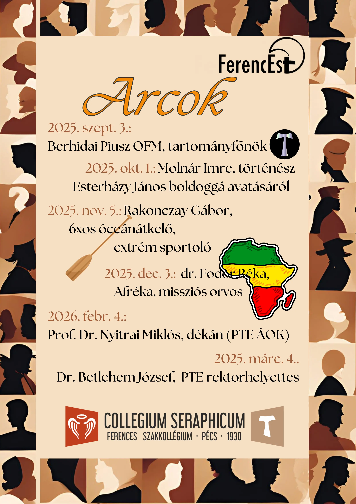
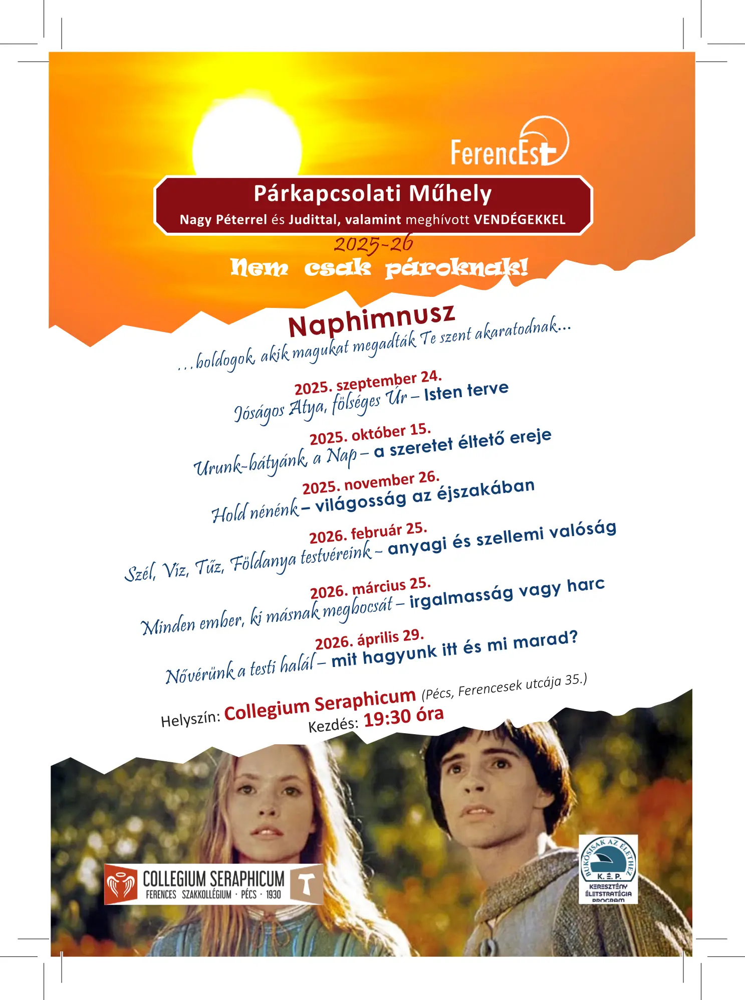
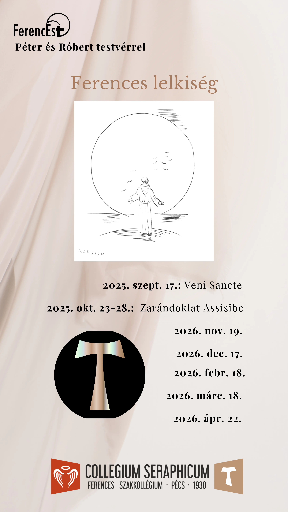
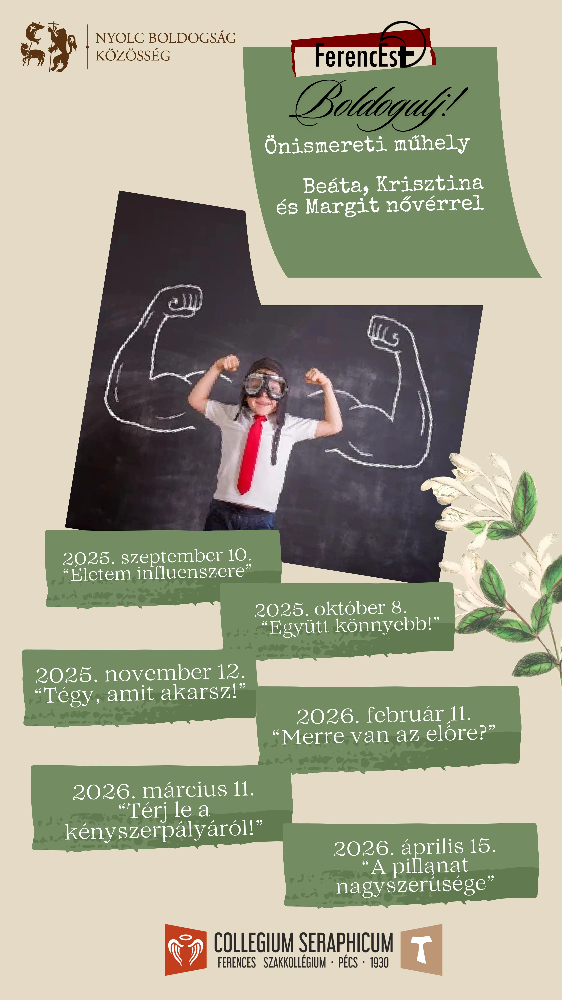

# 2024 - 2025

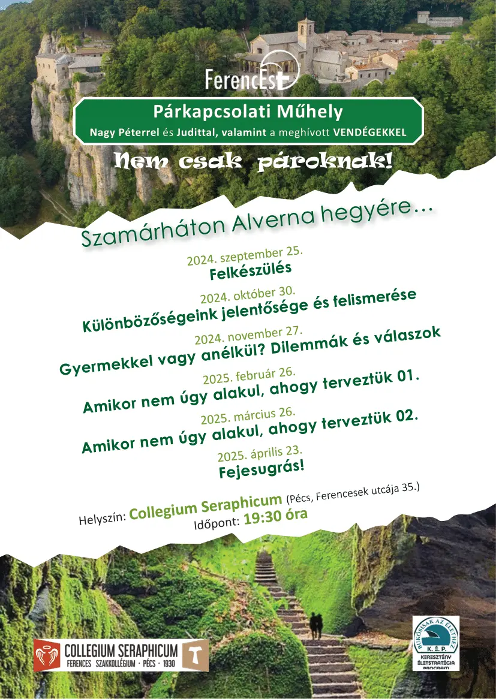
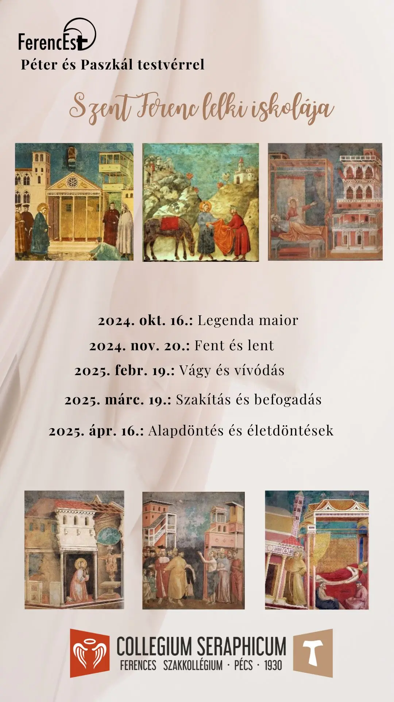
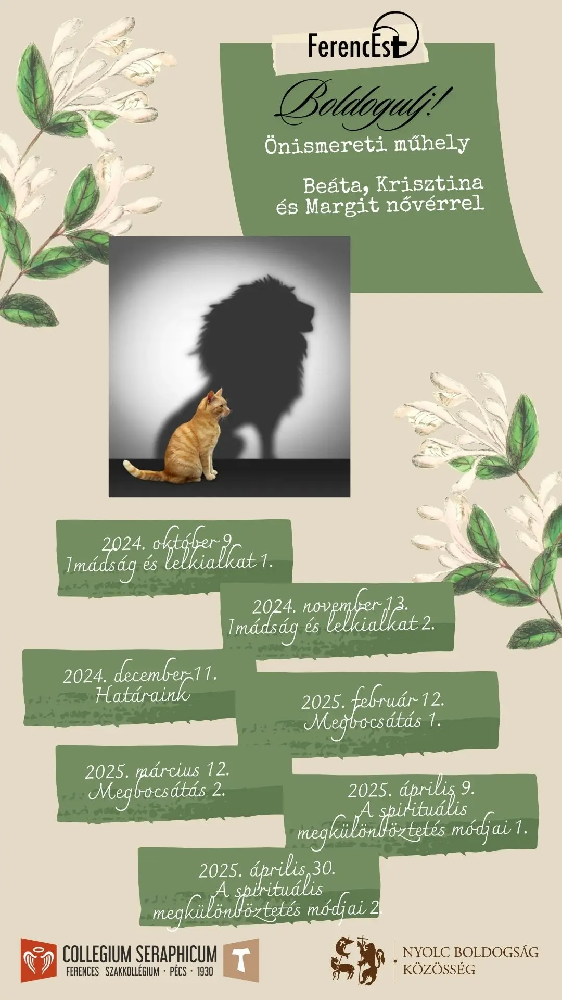

# 2023 - 2024

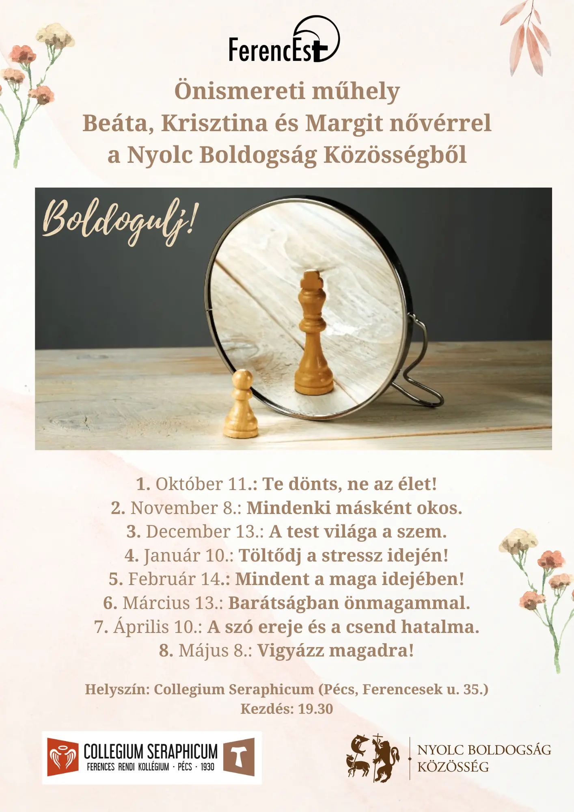
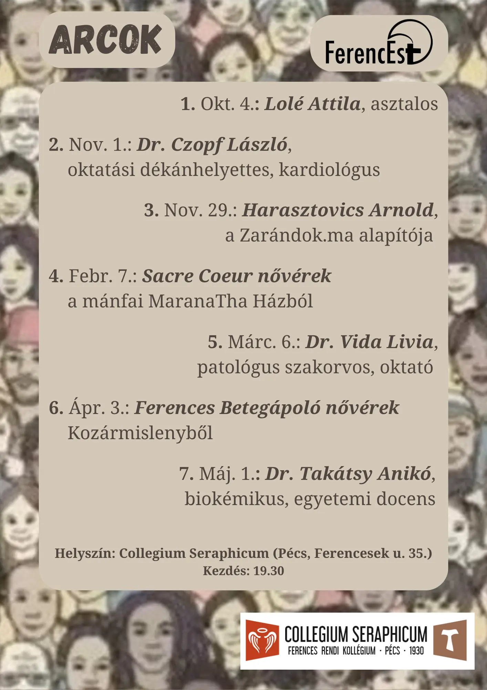
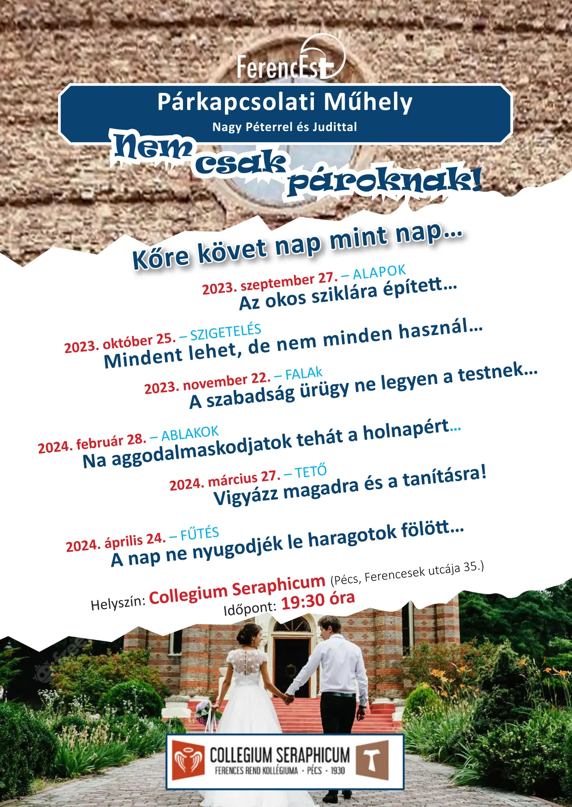
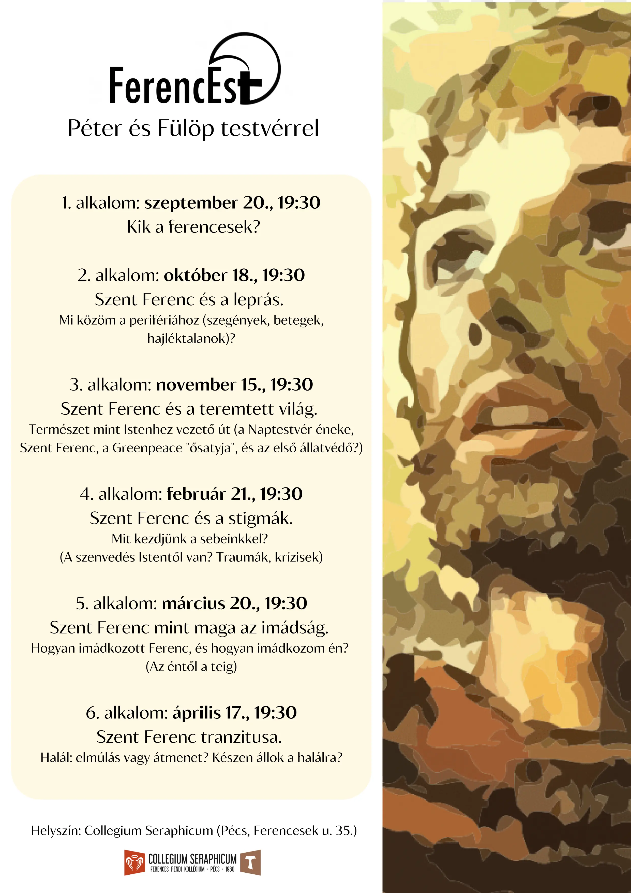
