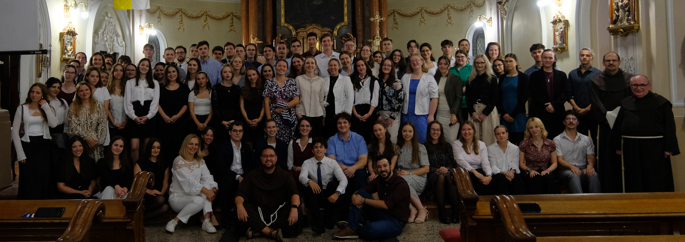
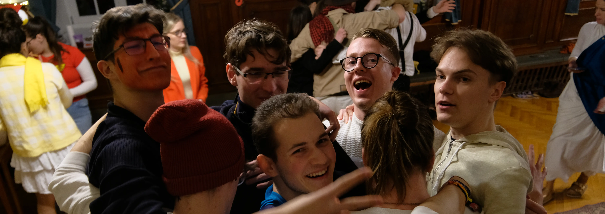
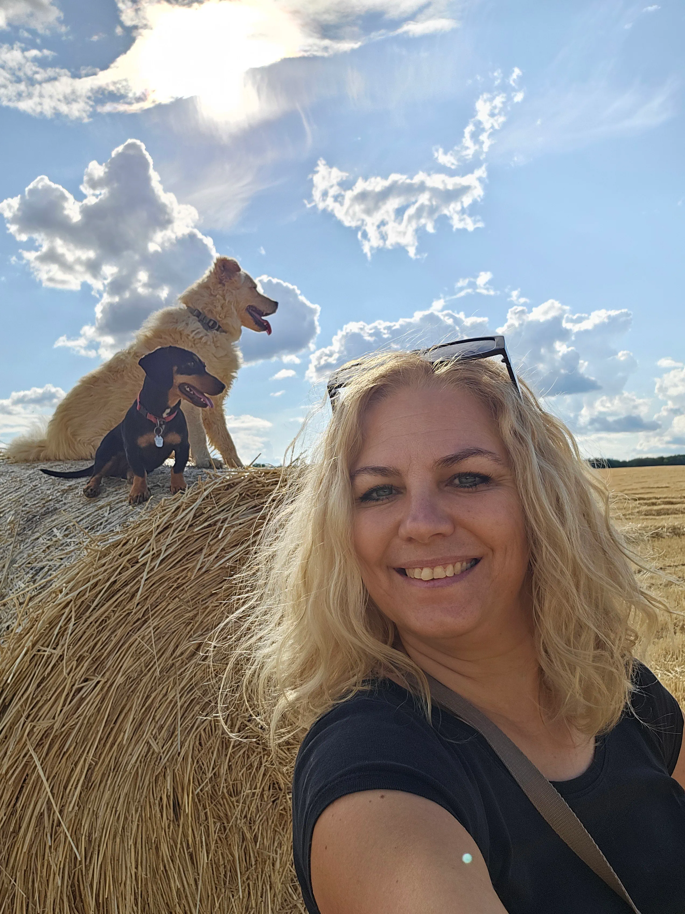

	
<h2 id="Menu" style="display: inline-block;">Menü</h2>

- [Rólunk](/rolunk.html)
- [Programok](/programok.html)
- [Média](/Media.html)
- [Szakmai nap](/SzakmaiNap.html)
- [Felvételi](/Felveteli.html)
- [Galéria](/Galeria.html)
- [Dokumentumok](/Dokumentumok.html)
- [DiákBizottság](/DB.html)
- [Felújítások](/felujitasok.html)
- [FerencEST](/ferencest.html)
- [Kapcsolat](/kapcsolat.html)

 

<h2 id="kedves" style="display: inline-block; border-bottom: none;">Kedves Gólyák!</h2>

Örömmel hirdetjük, hogy a ti érkezéseteket előkészítők szorgos csapata egy pdf-ben összefoglalta nektek a legfontosabb
tudni valókat! Még térkép is vagyon benne a zegzugos épület útvesztőjéről™. Használjátok
egészséggel! [Katt ide!](/src/Szeráf_KÉSZ_velemjáró.pdf)

### ***„Ahol lelke van a helynek, s helye a léleknek“***

Pécs város központjához közel, a történelmi belváros szélén, a ferences templom közvetlen szomszédságában egy ódon,
már-már titokzatos épület áll. Nagy, robusztus falai nem hivalkodóak, de mégis felkeltik az ember
kíváncsiságát. [...] [Tovább olvasnám](/rolunk.html)

### Nem csak egy szállást keresel, hanem egy befogadó közösséget?

Olyan emberek között töltenéd az egyetemi éveidet, akik az esetleges gondolkodásbéli különbségek ellenére azonos
értékrenddel rendelkeznek? Ahol teret és támogatást kapnál a hitedben, s ahol építeni tudnád az Istenkapcsolatodat?
Akkor jó helyen jársz, mert itt bizony megtalálod ezen értékeket! [Tovább a jelentkezéshez! ](/Felveteli.html)

### A szakkollégiummá válásunk óta sok érdekes és értékes programunk volt!

Járt nálunk Berhidai Piusz atya, Böjte Csaba testvér, Felföldi László püspök atya, tartottunk Véradást, Szakmai Napot,
tanultunk az újraélesztésről. (Még a félautomata defibrillátort is kipróbálhattuk a végtelenül türelmes bábun!) A
FerencESTeken rendszeresen fogadtunk különféle előadókat, így szellemileg is művelhettük magunkat a kollégium falain
belül. És mindez persze értelmetlen lett volna, ha nem tudjuk kifújni a gőzt és megpihenni, elbújva az élet forgatagától
valamelyik udvarunkon és tűz mellett sütögetni, sörpongozni vagy csak olvasgatni a napsütésében sütkérezve. Ezen
programokból [válogattunk össze itt néhányat!](programok.html)

	
<h3 style="display: inline-block;">Igazgatónő: Dobosiné Rizmayer Rita</h3>

Szeretettel köszöntök mindenkit a megújult honlapunkon, amelyet nagy büszkeségemre az egyik szeráflakó rakott össze 🙂 A fényképemet látva gondolom, nyilvánvaló, hogy mi a közös Szent Ferencben és bennem. Persze az állatok szeretetén túl igyekszem más területen is a nyomdokaiba lépni.  
            Szakmámat tekintve fordító, szinkrondramaturg és nyelvtanár vagyok, de azt tekintem a legfontosabb szerepemnek, hogy három (immáron nagy) gyermek édesanyja lehetek. Mellettük – a távol élő nagyszülők segítsége híján – az elmúlt években kifejleszthettem számos olyan képességet, amelyeket most a kollégium vezetését jelentő szerteágazó feladatok során kamatoztathatok.  
            Amikor 2023. nyarán Piusz atya felkért a kollégium vezetésére, azonnal éreztem, hogy valójában a Jóisten hív meg erre a feladatra, ezért nagy lelkesedéssel vetettem bele magam a Szeráf új életre keltésébe. Felújítottuk a kápolnát, az aulát, a Quadrumot és néhány zuhanyzót, létrehoztunk új közösségi tereket (klubszoba, DB-szoba), elindítottuk a szerdai FerencESTeket, szerveztünk véradást, találkozót számos fontos közéleti személlyel, átalakultunk szakkollégiummá és felállítottuk a  Diákbizottságot. 
            Örömmel mondhatom, hogy rendkívül tehetséges és aktív fiatalokkal van módom együtt dolgozni. Szinte „anyai büszkeséggel” szemlélem, ahogy kibontakoznak a szakkollégiumisággal együtt járó új feladataik ellátásában.  Mivel saját gyermekeim korban közel állnak a kollégistákhoz, még inkább át tudom érezni a szeráflakók gondjait és az örömeit, és igyekszem a kollégiumot az igényeiknek megfelelően alakítani. A célomat pedig így fogalmaztam meg az új SzMSz-ünkben: „A kollégium célja az itt lakó hallgató fiatalok emberi és szakmai fejlődésének előmozdítása, olyan értelmiségi fiatalok nevelése, akik nemcsak a saját szakterületükön törekszenek a legjobbak közé tartozni, hanem elkötelezett hitéletükkel képviselik a keresztény és ferences értékeket mind a kollégiumban, mind a hétköznapi életben, hozzájárulnak a társadalmi felelősségvállaláshoz, és önkéntes munkájukkal felelősségteljesen részt vesznek a Diákbizottság által irányított egyes munkacsoportokban, ezáltal gyakorolva és megtapasztalva a széleskörű autonómiával rendelkező önkormányzatiság jogait és felelősségét.”

 