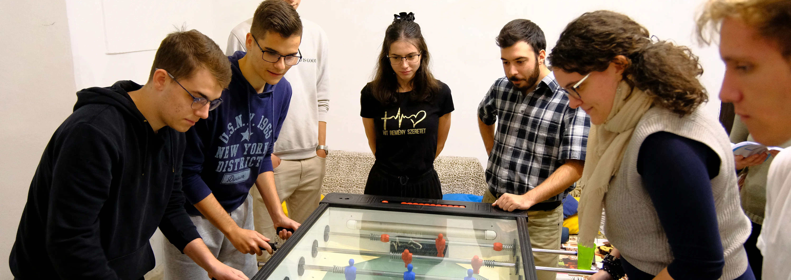

<link rel="stylesheet" href="https://cdnjs.cloudflare.com/ajax/libs/font-awesome/4.7.0/css/font-awesome.min.css">

	
<h2>Menü</h2>

- [Kezdőlap](/mobile_version.html)
- [Rólunk](/rolunk.html)
- [Programok](/programok.html)
- [Szakmai nap](/SzakmaiNap.html)
- [Felvételi](/Felveteli.html)
- [Galéria](/Galeria.html)
- [Dokumentumok](/Dokumentumok.html)
- [DiákBizottság](/DB.html)
- [Felújítások](/felujitasok.html)
- [Kapcsolat](/kapcsolat.html)

<header ID="social" >
        
        
        
</header>

 

# Programok

Az egyetemi és kollégiumi élet számos programmal együtjár. Vannak hivatalos szakkoli szervezésűek, ezek egy része
kötelező jellegű, úgy mint a Veni Sancte, FerencEstek, lelkigyakorlat, etc., más része azonban opcionális.
Kitűnő példák erre a sportbajnokságok.

Szerencsére még nem halt ki a spontaneitás művészete ifjaink közt, így rengeteg olyan kisebb esemény is nap- vagy
éppen holdvilágot lát, melynek a fogantatása, s születése közt nem telt el több, mint 1 hét/nap/óra/perc/pillanat...

Sajnos ezeket itt mind felsorolni nehéz lenne, ezért inkább nyugodtan használjátok a fentebb belinkelt szociális
médiáinkat, ahol előre szemezgettünk Nektek a legjobbakból...
 