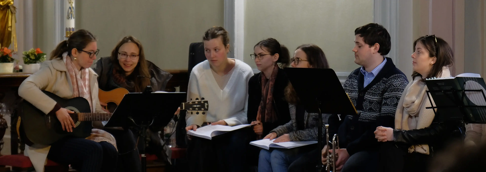

	
<h2 style="display: inline-block;">Menü</h2>

- [Kezdőlap](/mobile_version.html)
- [Rólunk](/rolunk.html)
- [Programok](/programok.html)
- [Média](/Media.html)
- [Szakmai nap](/SzakmaiNap.html)
- [Felvételi](/Felveteli.html)
- [Galéria](/Galeria.html)
- [Dokumentumok](/dokumentumok.html)
- [DiákBizottság](/DB.html)
- [Felújítások](/felujitasok.html)
- [FerencEST](/ferencest.html)
- [Kapcsolat](/kapcsolat.html)

 

### ***„Ahol lelke van a helynek, s helye a léleknek“***

Pécs város központjához közel, a történelmi belváros szélén, a ferences templom közvetlen szomszédságában egy ódon,
már-már titokzatos épület áll. Nagy, robosztus falai nem hivalkodóak, de mégis felkeltik az ember
kíváncsiságát. A főbejáraton belépve, hirtelen nyugodtság és csönd váltja fel a belvárosi nyüzsgést. A hosszú,
labirintusszerű folyosók és boltívek a régi idők ferences szerzeteseinek mindennapjairól mesélnek, míg a szembejövő
fiatal mosolygó arcok a fiatalságot és a vidámságot tükrözik. S hogy miért is „jó” itt lakni? Kedves látogató, hadd
üdvözöljünk a kollégiumunkban, Ahol lelke van a helynek, s helye a léleknek.

### S hogy a kollégium lakójaként mire számíthatsz?

Nem csak szállást keresel, hanem befogadó közösséget? Olyan emberek között töltenéd az egyetemi éveidet, akik az
esetleges gondolkodásbéli különbségek ellenére azonos értékrenddel rendelkeznek? Ahol teret és támogatást kapnál a
hitedben, s ahol építeni tudnád a kapcsolatodat Istennel? Akkor jó helyen jársz, mert itt megtalálod ezen értékeket!
Először is, nem kell félned a leendő szobatársadtól, hiszen a keresztény értékrend közös alapként mindannyiunkban ott
él. Nem leszel elveszett, mivel ebben a családias légkörben segítőkész felsőbb évesekre és egyben társakra találsz, akik
azon munkálkodnak, hogy te is mihamarabb megtaláld itt a helyedet. A kollégium zegzugos, labirintusszerű folyosói,
kápolnája és két belső kertje lehetővé teszik, hogy akkor és ott tanuljunk, kapcsolódjunk ki vagy éppenséggel leljünk
csendre, ahol kedvünk tartja. Maga az épület a belváros szívében, frekventált helyen található, közel a templomokhoz, a
vasútállomáshoz és a buszpályaudvarhoz. Ráadásul az egyetemi karok épületei is elérhetőek egy kényelmes sétával vagy
akár biciklivel. Ez a központi elhelyezkedés a közösség összetételén is visszaköszön, lévén, hogy minden karról és
megannyi szakról érkező hallgató gazdagítja és szélesíti a
látókörünk horizontját jelenlétével.

### Főbb programok

A szorgalmi időszaknak a tanévnyitó Veni Sancte és a tanévzáró Te Deum szentmisék adnak keretet. Közösen éljük meg a
rendalapító Assisi Szent Ferenc ünnepeit, valamint az egyházi évkör nagyobb ünnepeit. Ezen kívül a tanév során egy
alkalommal tartunk lelkigyakorlatot.

### Élet a kollégiumban

A tartalmas időtöltésnek színes tárházával rendelkezik a kollégium, így garantáltan mindenki megtalálja a számára tetsző
programokat. Itt biztosan nem fogsz unatkozni! A közösségbe való beilleszkedést többek közt „Ismerkedő est" is segíti,
ahol a hallgatók játékos feladatokon keresztül ismerkedhetnek meg egymással. Érdemes eljönni, hiszen szoros barátságok
köttethetnek itt. A szellemi és lelki fejlődést a kollégiumban hetente megszervezett „FerencEst” előadásai, illetve a
közös dicsőítések, szentségimádások segítik. Mindezeken felül a közösségi munkacsoport által szervezett programok
színesítik „a szürke hétköznapokat”, legyen szó sörpong bajnokságról, meme-versenyről, főző-sütő workshopról vagy épp
ruhacseréről.

Ha pedig itt maradnál hétvégére, aggodalomra semmi ok, hiszen a közös sütögetéssel, kerti mozizással és biciklitúrákkal
gyorsan elrepül az idő. A közös istenhitünkben gyökerező stabil értékrendünket megtartva törekszünk a folyamatos
megújulásra és az új tagok befogadására.

*„Értelmet adok neked, megtanítalak az útra, amelyen járnod kell.“*   (Zsoltárok 32, 8)

### Egy kis történelem

Az akkor még Kapisztrán Szent Jánosról nevezett Ferences Rendtartomány a pécsi rendházban 1930-ban hozta létre a
Collegium Seraphicum-ot azzal a céllal, hogy a leendő rendi növendékek középiskolai tanulmányaik alatt már élni tudják a
ferences szerzetesi életet. Kollégiumunk 1990-ben az országban elsőként nyitotta meg kapuit az egyházi felsőoktatási
kollégiumok közül. Ez évtől kezdődően – Dr. Vass László ferences konfráter kezdeményezésére – Mayer Mihály pécsi
megyéspüspök újraindította a kollégium életét, hogy abban a Pécsett tanuló, katolikus fiatalok még jobban megélhessék
hitvalló életüket. A Magyarok Nagyasszonya Ferences Rendtartomány 1998. január 1-jétől vette át az egyházmegyétől a
kollégium fenntartását.