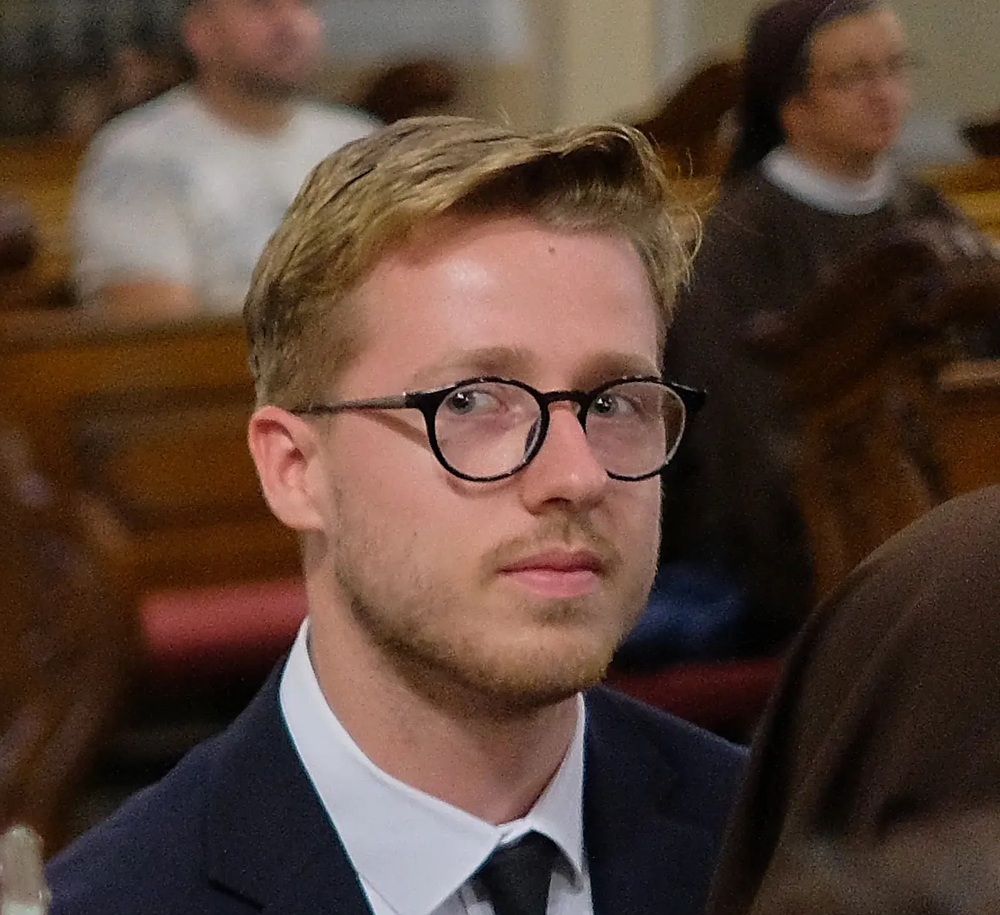
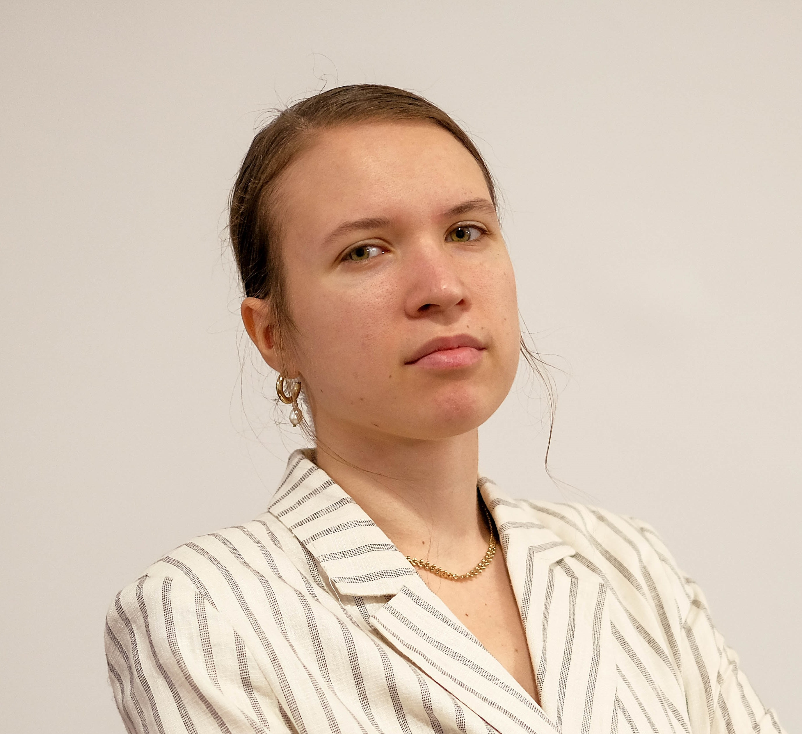

# Szaknap 2026

## Böhm Patrik (ÁJK)

### Megélhetési bűnözés jellemzői és bírói gyakorlata

Előadásomban egy rendkívül súlyos és aktuális jelenségről, a megélhetési bűnözésről beszéltem. A probléma gyökereinek
bemutatását követően ismerettem a releváns bíró gyakorlatot. Prezentációm végén pedig bemutattam néhány lehetséges
megoldást is, melyek által visszaszorítható lenne az elterjedtség.

## Dobai Gergely (ÁJK)

### A halálbüntetés

Az előadásomban a halálbüntetés általános elveit ismertettem, majd ezt követően konkrét jogeseteken keresztül mutattam
be ezen büntetési nem hibáit és visszásságait. Végezetül pedig részleteztem a halálbüntetés alkalmazása ellen szóló
legfontosabb érveket.

## Gyenese Anna (MK)

### Macbeth színházplakátok a kortárs tervezőgrafikában

Szakdolgozatomban szeretném megvizsgálni, hogyan viszonyulnak a kortárs színházplakátok tervezői Shakespeare: Macbeth
művéhez. Hiszen ezt a darabot a reneszánsz óta rengetegszer előadták, feldolgozták, megjelenítették - hogy birkózik meg
a kortárs grafikus ezzel a feladattal, hogy ezredjére is elkerülje a klisét, és újat mondjon a darabról? Továbbá hogyan
csapódnak le a plakát műfaján a darabot feldolgozó különböző kultúrák hagyományai és milyen eszközöket használnak a
tervezők, amelyek alapján a plakátok vonzóvá válnak az adott célközönség számára?

## Hertelendy Gellért (MIK)

### CMT (Cold Metal Transfer) additív gyártási paraméterek meghatározásához szükséges cseppszámlálás villamos érzékeléssel

A "CMT (Cold Metal Transfer) additív
gyártási paraméterek meghatározásához
szükséges cseppszámlálás villamos
érzékeléssel"  című TDK munkámat és a kutatási projektet mutattam be, melyben gépészmérnökökkel és villamosmérnökökkel
dolgozunk. Magyarul?: 3D nyomtatás alumíniummal és árammal. A hegesztés erős kapcsolatot tud létrehozni a rétegek
között, de csak bizonyos körülmények között. Az áram precíz mérésével meg tudjuk határozni az alumínium cseppenését és
ebből következtetni tudunk a folyamat minőségére, befolyásolni tudjuk a siker érdekében.

## Jekl Tamás (MK)

### A szövegfestő zene-G. F. Händel: Izrael Egyiptomban

Ének-zene tanári hallgatóként fontos számomra, hogy a zene és esetlegesen a zenetörténet ne egy utált tabu téma legyen.
Händel egyik zseniális, az Izrael Egyiptomban c. oratóriumán keresztül mutattam be, hogy a zenetöri vagy éppen a
zeneelmélet nem csak unalmas hadova. Az előadás fő témáját az oratórium zenei szövegfestése adta, ezen keresztül adtam
betekintést a zeneszerzés és zenei szövegfestés rejtelmeibe. A barokk kor egyik legnagyobb zeneszerzője G. F. Händel
tudta, hogy zenéje halhatatlan és örök életű lesz, bármikor, bármilyen körülmények közt is adják elő.

## Peilert Soma (TTK)

### A reform reformja? – a római rítus rövid története

A lex orando lex credendi alapelvből kiindulva (az imádság törvénye a hit törvénye) végigjárjuk a római rítus
történetét, annak kulturális vonatkozásaivak együtt. Különös figyelmet szentelünk a Bugnini-féle reformra, azzal
kapcsolatos kevésbé ismert részletekre, vagy tévhitekre. A latin nyelv szakrális használatának és a Kelet felé misézés
gyakorlatának lényegét, illetve jogi státuszát is tisztázzuk. A hagyományhűség és az ökumenikusság összefeszülésének
egyik példájaként tárgyaljuk a jelenleg is zajló konfliktusát a Vatikánnak és a X. Piusz Papi Testvérületnek.

## Folkmann-Papp Petra (ÁJK)

### Vakvágányon: Közbiztonság az igazság felett

Folkmann-Papp Petra, a Pécsi Tudományegyetem ötödéves jogász szakos hallgatója vagyok. Előadásomban a Móri bankrablás
teljes ügyét mutattam be, különös hangsúlyt fektetve a közbiztonság és az igazságszolgáltatás kapcsolatára, valamint
azokra a nyomozati hibákra és megválaszolatlan kérdésekre, amelyek az esetet mindmáig övezik. Ismertettem a forró nyomon
történő nyomozás sajátosságait, a raszternyomozás módszerét, továbbá kitértem arra is, hogy a modern technológiák és a
mesterséges intelligencia milyen lehetőségeket kínálhatnak a jövőben a hasonló hibák megelőzésére és a nyomozások
hatékonyabbá tételére. Számomra a móri ügy legfontosabb tanulsága az, hogy minden körülmény között törekednünk kell az
igazságos döntésre és ennek megfelelően, felelősségteljesen kell eljárnunk.

## Szí Benedek (ÁOK) : Fogorvosi készségfejlesztés 3D nyomtatott eszközökkel

TDK munkámban azt kutatom, hogyan lehet a leendő fogorvosok kézügyességét modern 3D nyomtatási technológiával
fejleszteni.

## Böhm Kristóf (ETK)

### Keringésmegállás a gyakorlatban – laikustól a professzionális ellátásig

A „Keringésmegállás a gyakorlatban – laikustól a professzionális ellátásig” című előadás átfogó képet ad az újraélesztés
teljes folyamatáról. A téma társadalmi szerepe kiemelkedő, hiszen Magyarországon évente 20.000-25.000 embert érint a
hirtelen keringésmegállás, így a laikusok által azonnal megkezdett mellkaskompresszió és a félautomata defibrillátor (
AED) használata kritikus élettani jelentőségű. Mivel minden perc késlekedés 10%-kal rontja a túlélés esélyét,
elengedhetetlen, hogy a társadalom tagjai felismerjék a bajt, azonnal tárcsázzák a 112-t, és ne féljenek cselekedni. Az
előadás mély szakmai jellege a mentők és a kórházi személyzet által végzett emelt szintű újraélesztési (ALS) protokollok
részletes bemutatásában mutatkozik meg. A professzionális fázis magában foglalja az EKG-ritmus szerinti sokkolandó és
nem sokkolandó állapotok elkülönítését, a reverzibilis okok célzott kezelését, valamint a komplex intenzív osztályos
utókezelést. A beteg hosszú távú túlélése és megfelelő életminősége tehát a laikusok gyors beavatkozásának és a
magasszintű egészségügyi szakmai munkának az elválaszthatatlan egységén múlik.

